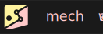

# mechaway
> **Hyperminimalist intelligent systems automation for open-source lovers.**

> abbr: M-Y

> Empowering engineers, scientists, analysts, and publishers

https://way.mecha.id

---

## 🧩 What is mechaway?

**mechaway** is a **workflow automation and data orchestration engine for intelligent systems**, written in **Rust**.  
It lets you visually connect nodes to build real-time, event-driven, and data-centric systems — from webhooks and APIs to IoT and AI.

Inspired by the core functionality of **Node-RED**, the friendly UX of **N8n**, and the efficient formats of **Huggingface** models. Support different cases of intelligent systems automation: 
- Realtime reactive microflows (fast telemetry) for sensors and actuators
- Lightweight backend management and explorer
- Agentic design with multimodal tools support 
- Bidirectional websocket interactions for AI companions, chatrooms, and multiplayer apps
- Durable orchestrator for long-running, resumable computation such as research simulation, ETL, ML training, and analysis

---

## 🚀 Some Features

| Principle | Description |
|------------|-------------|
| 🦀 **Hyperminimalist Core** | Built in Rust — no Node.js, no dependency bloat, no nonsense. |
| ⚙️ **Single Standalone Installer** | Ships as one binary (mechaway). Scales later by simply enabling external drivers (NATS, Postgres, K8s) |
| ⚙️ **Composable DAG Engine** | Each workflow is a Directed Acyclic Graph (DAG) executed in-memory using Petgraph for deterministic flow. |
| 🔥 **Hot-Reload Architecture** | Edit and save workflows — instantly live, no server restart. |
| 🌍 **Universal Connectivity** | First-class nodes for HTTP, WebSocket, gRPC, Pub/Sub, ArangoDB, TimescaleDB, and AI pipelines. |
| 🧠 **Intelligent Data Layer** | JSON and Tabular transformation nodes, powered by `jsonpath_lib` and `polars`. |
| 🧩 **Extensible by Design** | Add new nodes as `.so` or `.wasm` plugins — no pod restart, no rebuilds. |
| 💾 **Built-in Data Store** | Integrated lightweight data layer with simple tabular + vector DB and a minimalist network file system. |
| 🧠 **AI-Ready** | Integrate Hugging Face models, Piper TTS, and other open AI tools directly as node containers. |
| 🖥️ **Workflow Explorer Component** | A desktop-style hierarchical layout for browsing projects, folders, and workflows, that you can integrate directly on your React-based web app |
| 💬 **Polyglot Client SDKs** | Tiny mechaway-client libraries (Python, ) for task coordination to any M-Y instance. |

---

- **Hot-reloadable DAGs** — stored in SQLite, executed fully in memory.  
- **Dynamic Plugin System** — supports `.so` (native) and `.wasm` (sandboxed) node packs.  
- **In-Process Execution** — ultra-fast native execution of logic and transformation nodes.  
- **Optional Distributed Mode** — scale across pods via gRPC or PubSub.
- **Built-in Storage** — tabular store, vector search, and networked file system for data persistence and caching.

---

## 🧩 Core Node Categories

| Type | Description |
|------|--------------|
| **Simple Data Nodes** | Lightweight storage and vector database nodes, including SQLite, simple key-value, and embedded vector stores. |
| **Simple Network Filesystem Node** | Minimalist internal filesystem, and distributed filesystem connector for file sharing over the network. |
| **Data Processing Nodes** | JSONTransform, TabularTransform, CSV/Parquet, GISTransform processing. |
| **Compute Nodes** | RouteNode, WASMNode, FunctionNode, DockerNode, TaskExecutorNode for local or external computation. |
| **Integration Nodes** | HTTP, WebSocket, PubSub, gRPC for inter-service communication. |
| **Database Nodes** | Postgres, PostGIS, ArangoDB, TimescaleDB for structured or graph-based data. |
| **AI / ML Nodes** | LLM, HuggingFace, Whisper, Piper, Llama for open-source AI inference. |
| **Trigger Nodes** | Webhook, Scheduler, EventStream for reactive and time-based triggers. |


---

## Development Strategy

### Layered Architecture Overview

| Layer | Description | Core Tech |
|--------|--------------|-----------|
| **Frontend (UI)** | Visual workflow editor, node linking, real-time status. | React + TypeScript + Tailwind + ReactFlow |
| **Workflow Manager** | Manages workflow DAGs, serialization, and hot reload. | Rust (`serde`, `tokio`, `sqlx`, `uuid`) |
| **Runtime Engine** | Executes DAG nodes asynchronously and deterministically. | Rust (`petgraph`, `tokio`, `tracing`) |
| **Logic Engine** | Executes embedded logic (Lua / WASM / Rust dynamic libs). | Rust (`mlua`, `wasmtime`, `libloading`) |
| **Data Store** | Built-in hybrid store for tabular, vector, and file data. | Rust (`polars`, `tantivy`, `sled`) |
| **Plugin Layer** | Loads `.so`, `.dll`, or `.wasm` plugins at runtime. | Rust (`libloading`, `wasmtime`) |
| **AI Layer** | Integrates AI models, embeddings, and containerized ML tools. | Rust (`reqwest`, `tch`, `onnxruntime`) |

### Example Workflow Definition
```json
{
  "id": "wf-grading",
  "name": "grading_workflow",
  "nodes": [
    { "id": "n1", "type": "WebhookNode", "params": { "path": "/grade" } },
    { "id": "n2", "type": "JSONTransformNode", "params": { "map": "{id=$.id, score=$.score}" } },
    { "id": "n3", "type": "FunLogicNode", "params": { "engine": "mlua", "script": "for _,r in ipairs(data) do if r.score>70 then ... end end" } },
    { "id": "n4", "type": "PostgresNode", "params": { "table": "grades" } }
  ],
  "edges": [
    { "from": "n1", "to": "n2" },
    { "from": "n2", "to": "n3" },
    { "from": "n3", "to": "n4" }
  ]
}
```

### Rust Internal Representation

```rs
struct Workflow {
    id: String,
    name: String,
    nodes: Vec<Node>,
    edges: Vec<Edge>,
}

struct Node {
    id: String,
    node_type: NodeType,
    params: serde_json::Value,
}

enum NodeType {
    Webhook,
    JSONTransform,
    FunLogic,
    Database,
    Plugin,
}

struct Edge {
    from: String,
    to: String,
}
```

- Workflows are stored as JSON/YAML in SQLite or any persistent store.
- DAG relationships are built via petgraph::Graph<Node, Edge> for fast traversal.
- Workflows can be dynamically reloaded via a registry and event listener.

### Execution Pipeline
- Frontend Save Event
  - User saves workflow → JSON uploaded to backend API.
- Workflow Reload
  - WorkflowRegistry parses and validates → rebuilds DAG in memory.
- Webhook Trigger
  - Incoming /webhook/:workflow_id/:path event triggers execution.
- Runtime Execution
  - Each node executes asynchronously, topologically sorted.
- Logic Dispatch
  - If node type is logic-based, delegate to mlua/WASM/plugin engine.
- Output Propagation
  - Pass result to downstream nodes as serde_json::Value.

### Logic Engines (Multi-Layer Execution)

Lua Engine (mlua)
- Used for FunLogicNode and visual logic blocks.
- Fully embedded, sandboxed, zero external dependencies.
- Enables conditionals, loops, variable manipulation in microseconds.

Example:
```lua
let lua = Lua::new();
lua.globals().set("data", serde_json_to_lua(data)?)?;
let result: Value = lua.load(&script).eval()?;
```

Features:
- Vendored Lua 5.4 or Luau (Roblox JIT)
- serde integration for JSON bridging
- Memory and instruction limits for safety

---

## 💡 Vision

> To empower developers, researchers, and makers
> with a **minimalist**, **reliable**, and **intelligent** automation platform  
> that honors the open-source ecosystem —  
> **fast enough for robotics, simple enough for data flows, and open enough for ideas.**

---

## 🛠️ Installation (Coming Soon)

```bash
cargo install mechaway
mechaway start
